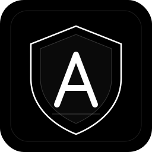
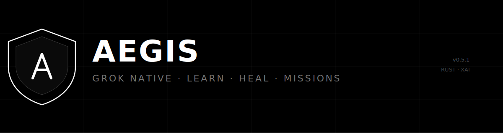
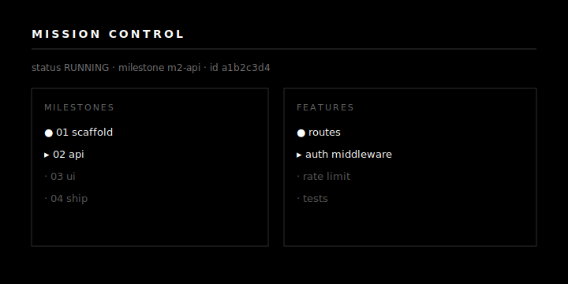

<p align="center">
  
</p>

<h1 align="center">AEGIS</h1>

<p align="center">
  <strong>Sovereign Grok-native coding agent</strong><br/>
  <sub>Rust · tools · Missions · project learning</sub>
</p>

<p align="center">
  
  
  
  
  <a href="https://github.com/denster32/aegis/wiki"></a>
</p>

<p align="center">
  
</p>

---

## Why

| | |
|---|---|
| **Grok OAuth** | Reuses `grok login` / `~/.grok/auth.json` |
| **Grok 4.5** | `reasoning.effort` · `prompt_cache_key` · server tools |
| **Tools** | read / write / edit / bash / glob / grep / git / web / memory / vision |
| **Learning** | Self-heal mid-run · reflect · `.aegis/` memory |
| **Missions** | Plan → Mission Control → execute → validate |
| **Platform** | Dream · readiness · factory · wiki · QA · review · automations |
| **Nexus** | Evolve · spore · compress · hardware · capability map |
| **Binary** | ~16 MB Rust CLI · ~2 ms cold start · no Node runtime |

<p align="center">
  
</p>

## Install

```bash
git clone https://github.com/denster32/aegis.git
cd aegis
./install.sh
aegis --version
```

```bash
grok login          # or: aegis login
aegis auth status
```

## Quick start

```bash
aegis -p "Reply with exactly: pong"
aegis --yolo --effort low -p "Create hello.txt with hi"
aegis readiness
aegis factory
aegis missions new "add a /health endpoint"
aegis missions run <id>
```

## CLI

| Command | Purpose |
|---------|---------|
| `aegis` / `-p` | REPL / one-shot |
| `aegis plan` | Structured plan |
| `aegis mission` | Swarm DAG |
| `aegis missions *` | Factory Missions |
| `aegis memory *` | Project learning |
| `aegis readiness` | L1–L5 readiness |
| `aegis factory` | SDLC coverage map |
| `aegis dream` | Nightly self-improve |
| `aegis wiki *` | AutoWiki |
| `aegis review` | PR / local diff |
| `aegis qa` | Automated QA |
| `aegis automation *` | Schedules / events |
| `aegis checkpoint *` | Git checkpoints |
| `aegis vision` | Image describe |
| `aegis auth` / `login` | OAuth |
| `aegis nexus status` | Nexus organism overview |
| `aegis evolve *` | Mutation genes + fitness |
| `aegis spore *` | Viral pack / vaccinate |
| `aegis compress` | Neural summary |
| `aegis hardware *` | Host probe / throttle |

**Flags:** `--effort low|medium|high` · `--yolo` · `--sandbox` · `--cwd` · `--session` · `--no-learn` · `--stream` · `-v` · `-m`

See [docs/nexus.md](docs/nexus.md).

## Terminal UI

SpaceX / xAI monochrome: white primary · dim secondary · thin rules · geometric marks `● · ▸ ×`

```
AEGIS  0.8.0
────────────────────────────────────────────────────────
  session         a1b2c3d4
  model           grok-4.5
  effort          medium
  mode            prompt
  cwd             /path/to/project
────────────────────────────────────────────────────────
›
```

## Architecture

```
aegis (CLI)
  ├── aegis-core         agent · missions · dream · factory · ui
  ├── aegis-auth         Grok OAuth
  ├── aegis-xai          Responses API
  ├── aegis-tools        coding tools + locks + capability map
  ├── aegis-memory       .aegis/ learning · neural summary
  ├── aegis-swarm        DAG + Mission Control
  ├── aegis-evolution    mutation genes + fitness
  ├── aegis-spore        viral pack / vaccinate
  ├── aegis-hardware     host probe + throttle policy
  ├── aegis-context      workspace pack
  ├── aegis-store        SQLite sessions
  └── aegis-mcp          optional MCP
```

<p align="center">
  
</p>

## Docs

| | |
|---|---|
| [**Wiki**](https://github.com/denster32/aegis/wiki) | GitHub Wiki (synced from [docs/wiki/](docs/wiki/)) |
| [features.md](docs/features.md) | Feature matrix |
| [nexus.md](docs/nexus.md) | Living immune system |
| [architecture.md](docs/architecture.md) | Crates |
| [xai-capabilities.md](docs/xai-capabilities.md) | Grok 4.5 knobs |
| [learning.md](docs/learning.md) | Memory & heal |
| [missions.md](docs/missions.md) | Factory Missions |
| [stress.md](docs/stress.md) | Live stress harness |
| [RELEASE.md](docs/RELEASE.md) | Release / verify |
| [SECURITY.md](SECURITY.md) | Threat model |
| [audit-2026-07-12.md](docs/audit-2026-07-12.md) | Full audit |

## Smoke & stress

```bash
./scripts/live_smoke.sh
./scripts/stress_test.sh
```

## License

MIT — [LICENSE](LICENSE)
